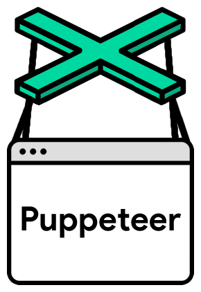

## Puppeteer

#### 出现的背景

Chrome59(linux、macos)、 Chrome60(windows)之后，Chrome自带[headless(无界面)模式](https://developers.google.com/web/updates/2017/04/headless-chrome)很方便做自动化测试或者爬虫。但是如何和headless模式的Chrome交互则是一个问题。通过启动Chrome时的命令行参数仅能实现简易的启动时初始化操作。Selenium、Webdriver等是一种解决方案，但是往往依赖众多，不够扁平。



Puppeteer是谷歌官方出品的一个通过DevTools协议控制headless Chrome的Node库。可以通过Puppeteer的提供的api直接控制Chrome模拟大部分用户操作来进行UI Test或者作为爬虫访问页面来收集数据。

[中文文档](https://zhaoqize.github.io/puppeteer-api-zh_CN/#/)

### 作用：

**能做什么?**

- 生成页面 PDF。
- 抓取 SPA（单页应用）并生成预渲染内容。
- 自动提交表单，进行 UI 测试，键盘输入等。
- 创建一个时时更新的自动化测试环境。 使用最新的 JavaScript 和浏览器功能直接在最新版本的Chrome中执行测试。
- 捕获网站的 [timeline trace](https://developers.google.com/web/tools/chrome-devtools/evaluate-performance/reference)，用来帮助分析性能问题。
- 测试浏览器扩展。

#### 环境和安装

Puppeteer本身依赖6.4以上的Node，但是为了异步超级好用的[async/await](http://es6.ruanyifeng.com/#docs/async)，推荐使用7.6版本以上的Node。另外headless Chrome本身对服务器依赖的库的版本要求比较高，centos服务器依赖偏稳定，v6很难使用headless Chrome，提升依赖版本可能出现各种服务器问题（包括且不限于无法使用ssh），最好使用高版本服务器。

Puppeteer因为是一个npm的包，所以安装很简单：

> npm i puppeteer  
>
> yarn add puppeteer

Puppeteer安装时自带一个最新版本的Chromium，可以通过设置环境变量或者npm config中的PUPPETEER_SKIP_CHROMIUM_DOWNLOAD跳过下载。如果不下载的话，启动时可以通过puppeteer.launch([options])配置项中的executablePath指定Chromium的位置。

#### 使用和例子

Puppeteer类似其他框架，通过操作Browser实例来操作浏览器作出相应的反应。

```js
// 引入puppeteer库
const puppeteer = require('puppeteer');
(async () => {
  // 加载浏览器
  const browser = await puppeteer.launch();
  // 打开一个新页面
  const page = await browser.newPage();
  // 前往url地址
  await page.goto('http://rennaiqian.com');
  // 屏幕截图
  await page.screenshot({ path: 'example.png' });
  // 下载pdf
  await page.pdf({ path: 'example.pdf', format: 'A4' });
  // 关闭页面
  await page.close();
  // 关闭浏览器
  await browser.close();
})();
```

page.evaluate(pageFunction, ...args)，

可以向页面注入我们的函数

```js
const puppeteer = require('puppeteer');

(async () => {
  const browser = await puppeteer.launch();
  const page = await browser.newPage();
  await page.goto('http://rennaiqian.com');

  // Get the "viewport" of the page, as reported by the page.
  const dimensions = await page.evaluate(() => {
    return {
      width: document.documentElement.clientWidth,
      height: document.documentElement.clientHeight,
      deviceScaleFactor: window.devicePixelRatio
    };
  });

  console.log('Dimensions:', dimensions);
  await browser.close();
})();
```

需要注意的是evaluate方法中是无法直接使用外部的变量的，需要作为参数传入，想要获得执行的结果也需要return出来。

#### 调试技巧

1. 关掉无界面模式

   有时查看浏览器显示的内容是很有用的。使用以下命令可以启动完整版浏览器：

```js
const browser = await puppeteer.launch({headless: false})
```

2. 减慢速度，

   slowMo选项以指定的毫秒减慢Puppeteer的操作。这是另一个看到发生了什么的方法：

```
const browser = await puppeteer.launch({
  headless:false,
  slowMo:250
});
```

3. 捕获console的输出,通过监听console事件。在page.evaluate里调试代码时这也很方便：

```js
page.on('console', msg => console.log('PAGE LOG:', ...msg.args));
await page.evaluate(() => console.log(`url is ${location.href}`));
```

4. 启动详细日志记录

   所有公共API调用和内部协议流量都将通过puppeteer命名空间下的debug模块进行记录

```js
 # Basic verbose logging
 env DEBUG="puppeteer:*" node script.js
 # Debug output can be enabled/disabled by namespace
 env DEBUG="puppeteer:*,-puppeteer:protocol" node script.js # everything BUT protocol messages
 env DEBUG="puppeteer:session" node script.js # protocol session messages (protocol messages to targets)
 env DEBUG="puppeteer:mouse,puppeteer:keyboard" node script.js # only Mouse and Keyboard API calls
 # Protocol traffic can be rather noisy. This example filters out all Network domain messages
 env DEBUG="puppeteer:*" env DEBUG_COLORS=true node script.js 2>&1 | grep -v '"Network'
```

#### 爬虫实践

很多网页通过user-agent来判断设备，可以通过page.emulate(options)来进行模拟。

options有两个配置项，一个为userAgent，另一个为viewport可以设置宽度(width)、高度(height)、屏幕缩放(deviceScaleFactor)、是否是移动端(isMobile)、有无touch事件(hasTouch)。

```js
const puppeteer = require('puppeteer');
const devices = require('puppeteer/DeviceDescriptors');
const iPhone = devices['iPhone 6'];

puppeteer.launch().then(async browser => {
  const page = await browser.newPage();
  await page.emulate(iPhone);
  await page.goto('https://www.example.com');
  // other actions...
  await browser.close();
});
```

上述代码则模拟了iPhone6访问某网站，其中devices是puppeteer内置的一些常见设备的模拟参数。

很多网页需要登录，有两种解决方案：

1. 让puppeteer去输入账号密码 

   常用方法：

   ```js
   // 点击可以使用
   page.click(selector[, options])
   // 聚焦
   page.focus(selector)
   // 输入指定的字符串，options中设置delay缓慢输入更像真人一些
   page.type(selector, text[, options])
   // 来一个字符一个字符的输入
   keyboard.down(key[, options])
   ```

2. 如果是通过cookie判断登录状态的可以通过page.setCookie(...cookies)，想要维持cookie可以定时访问。

**Tip：有些网站需要扫码，但是相同域名的其他网页却有登录，就可以尝试去可以登录的网页登录完利用cookie访问跳过扫码。**

#### 简单例子

```js
const puppeteer = require('puppeteer');

(async () => {
  const browser = await puppeteer.launch({ headless: false });
  const page = await browser.newPage();
  await page.goto('https://baidu.com');
  await page.type('#kw', 'puppeteer', { delay: 100 });
  page.click('#su')
  // 等待一秒
  await page.waitFor(1000);
  // 获取查询结果中 标题包含“入门及实践(1)”的内容
  const targetLink = await page.evaluate(() => {
    return [...document.querySelectorAll('.result a')].filter(item => {
      return item.innerText && item.innerText.includes('入门及实践(1)')
    }).toString()
  });
  await page.goto(targetLink);
  await page.waitFor(1000);
  browser.close();
})()
```

