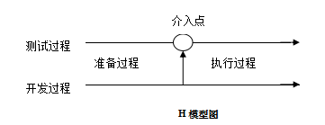
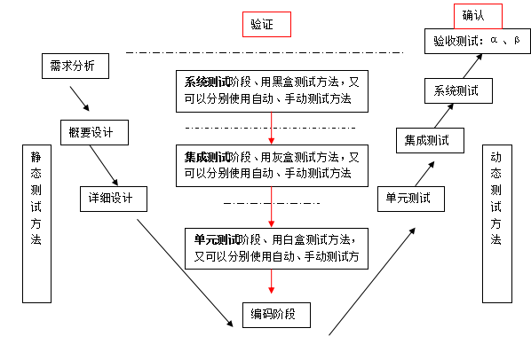

## 测试基础

#### 1. 什么是测试？

- 两个依据：以需求为基础，通过测试用例执行
- 两个方法：手工和自动
- 一个对比：预期结果和实际结果的对比

#### 2. 测试的目的和意义？

- 初期：尽可能多的发现缺陷
- 中期：尽量早的发现缺陷
- 后期：预防问题，通过以往的经验积累
- 控制成本尽量少的时间和人力发现更多的缺陷

#### 3. 软件的生命周期

- 计划
- 需求分析
- 设计
- 编码
- 测试
- 运行维护

如何尽可能多的发现缺陷？

1. 沟通

   测试前期与开发沟通，确认测试重点，确认测试的优先级

   了解开发人员技术和业务背景，业务水平，技术水平，代码质量以及人员流动

2. 测试结束后

   对以发现的缺陷进行统计 了解高发概率缺陷，在后续功能中重点测试

3. 针对代码   代码复杂度？

4. 版本管理

   验收的最后一版一定要进行完全的回归测试

5. 测试方法

   黑盒方法，功能问题，无法保证所有的代码逻辑都被执行到，用白盒测试思想补充黑盒测试

   静态测试方法，文档评审，代码审查（白猫平台）

6. 测试过程

   上一阶段为下一阶段提供重点指导，用户参与的测试或用户反映回来的错误和问题为下次测试补充的必备内容

## 测试过程

#### 1. 测试模型

- H 模型

  

  优点：

  1. 介入早，与开发并行，可以更早的发现缺陷
  2. 测试过程独立于开发过程，更客观，更主动

  缺点：

  1. 更早的介入，人力成本和时间成本更高

- V 模型

  

  1. 需求分析

     产品经理，项目经理根据业务老师需求，确定需求

     测试工作：对需求进行测试和评审a系统测试计划，b系统测试方案，c系统测试用例

  2. 设计阶段（太保没有这个阶段）

     开发经理，架构师，开发工程师写出《概要设计说明书》

     测试工作：对概要设计说明书进行测试和评审

  3. 详细设计

     开发工程师，架构师写出《详细设计说明书》

     内容：函数，代码代码逻辑

     测试工作：对详细设计说明书进行测试和评审

  4. 编码阶段

     开发工程师写代码

     优点：介入早，提高测试质量，分成三个阶段，发现问题更有针对性，测试开发并行，更好的利用项目资源

     缺点：项目成本高，技术要求高，对人员要求高，并行中，一旦有一方未完成就会造成整体的延误

  5. 单元测试

     用白盒测试的方法，进行测试，可以手工也可以自动化

     函数代码逻辑的测试，验证代码逻辑是否符合详细设计说明书

     经济价值：更早的介入，降低修复成本

     缺点：技术难度高，工作量大

  6. 集成测试

     用灰盒测试的方法，可以手工自动化

     验证模块和子模块的接口是否符合详细设计说明说

     优点：能够更准确的定位到缺陷问题，从而降低修复缺陷的成本

     缺点：接口测试技术要求高，技术实现难度大，接口庞大过多的测试成本大

  7. 系统测试

     用黑盒测试的方法，可以手工自动化

     验证产品是否符合需求规则说明书

     优点：能够保证产品质量，简单，技术要求低

     缺点：介入时间晚，修复成本高，一些问题可能导致无法在本次版本修复

  8. 验收测试α，β

     好处：

     1. 内部测试只能模拟用户使用而不能代替用户使用
     2. 无法模拟用户的个人习惯
     3. 测试人员对产品的认识可能与用户不一致

     α测试：由少部分用户在开发环境下进行测试     内侧

     β测试：所有的系统使用者都可以参与测试         公测

#### 2. 内部测试

​	内部人员进行单元测试，集成测试和系统测试

#### 3. 外部测试

​	使用验收测试的方式

#### 4. 回归测试

​	回归测试可以发生在任何一个阶段

- 完成回归：每次回归需要执行全部用例，优点：测试全面，覆盖广，不容易漏测；缺点：工作量大，成本高

- 部分回归：

  - 覆盖修改法：每次回归测试只执行错误用例的部分：优点：时间短，成本低，效率高；缺点：回归测试不够充分，可能遗漏缺陷
  - 周边影响法：除了回归错误用例，还要执行周围相关用例
  - 指标达成法：每次回归达到指定的指标就可以了

  确认周边范围的方法：

  1. 界面检查法：明确被修改的功能，还有上下游功能，同模块相似的功能
  2. 代码检查法：修改代码的函数和周边的函数

#### 5.各阶段准入准出规则

- 单元测试
- 集成测试
- 系统测试

## 测试方法

- 黑盒测试

  - 优点：简单，测试效率高

  - 缺点：

    1.无法保证所有的代码逻辑都被测试到
    2、后台相关的非界面处理可能会遗漏（文件、数据库）
    3、当前功能与其他功能有联系的部分可能也会被遗漏

- 白盒测试

  - 优点：覆盖充分，可以覆盖到每行代码
  - 缺点：技术较难，效率较低，成本较高

- 灰盒测试

  - 优点：可以提早定位和发现问题
  - 缺点：技术最难，成本最高

- 静态测试

  - 优点：较动态测试时间早,不用写代码
  - 缺点：工作量大

- 动态测试

  - 优点：复杂，效率高
  - 缺点：测试较晚介入,写代码

- 手工测试

  - 优点：能够主动的发现bug
  - 缺点：重复工作量大，容易引入疲劳缺陷,只能依靠见到的界面

- 自动化测试

  - 优点：可以无限制不断重复,把人从劳动里解放出来，提高劳动效率，提高了测试质量，能发现人不能发现的错误
  - 缺点：无法发现脚本中未写明的缺陷

> 三大类：测试对象（黑，白，灰），测试方法（手，自），程序是否执行（静，动）

## 软件质量

#### 1.什么是软件质量

- 质量：确保功能满足用户的需求

- 内部质量：开发阶段评估
- 外部质量：用户的评价
- 过程质量：研发的每个阶段

#### 2.质量的要素

- 质量铁三角：技术，过程，组织

#### 3.6大特性和27个子特性

​	**6大特性**

- 功能性：
- 可靠性
- 易用性
- 效率
- 维护性
- 可移植性

## 用例设计

等价法

边界值法

判定表法

因果法

