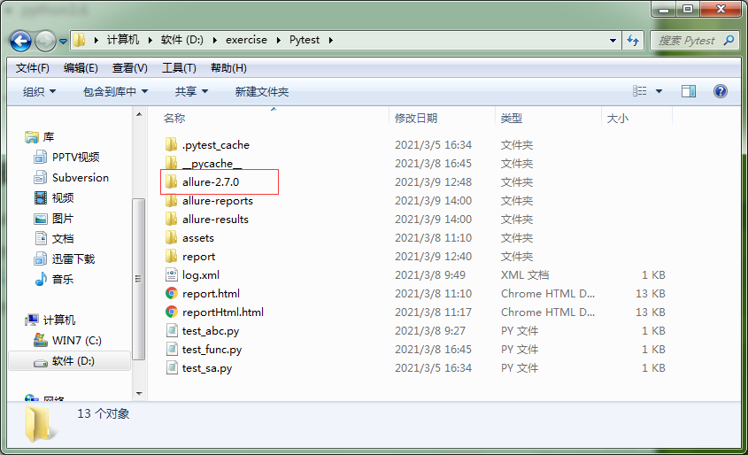
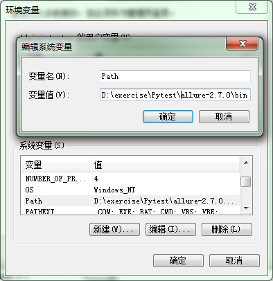
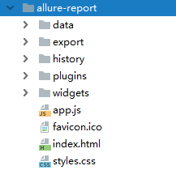

## 前言

allure 是一个 report 框架，支持 python 的 pytest 框架，也支持 java 的 Junit/testing 框架，也可以集成到 Jenkins 上展示高大上的报告界面

环境准备（windows环境）

- python3.6
- pycharm
- pytest-allure-adaptor
- allure2.7.0


## 安装 Command Tool

allure 有两个版本，版本1已经停止维护了，现在使用allure2

下载地址：(https://dl.bintray.com/qameta/generic/io/qameta/allure/allure/2.7.0/allure-2.7.0.zip)

下载后解压到pytest目录



配置环境变量 allure-2.7.0/bin 目录

计算机=》属性=》 高级系统设置=》 高级 =》 环境变量 =》 系统变量=》 Path



## 使用

#### 1.安装allure-pytest

```
pip install allure-pytest
```

#### 2.安装pytest-html（不需要？）

```
pip install pytest-html
```

#### 3.运行allure2

```
pytest --alluredir=report test_func.py
pytest --alluredir=目录（report/test） 单元用例
```

#### 4.生成报告命令

执行report文件下的内容，生成allure-filename

```
allure generate --clear report(directory)
allure generate 需要执行的目录 -o 生成目录
```

- --clear 清空上一个目录

目录结构：

    


#### 5.运行查看报告

1. 直接通过 pyCharm 打开

2. 命令行方式打开

   ```
   # 本地打开
   allure open 
   # 服务器的方式查看，本地渲染后对外展示
   allure serve 
   ```


> 常见问题：
>
> 1. allure 执行不是内部命令
>
>    解决：配置环境变量，关闭cmd，重新打开