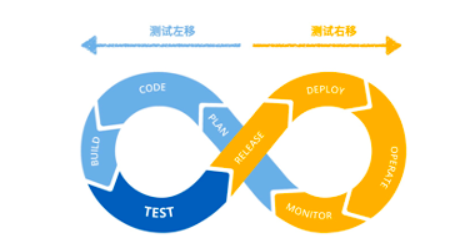
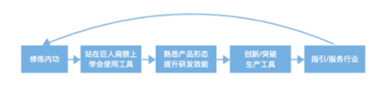
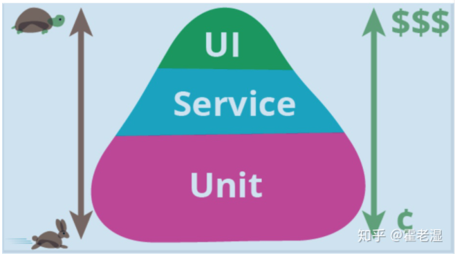

## 张挺 路线

* [ ] 1、**学习 python 基础语法**
* [ ] 2、学习 HTML、CSS、JavaScript 三大件，xml，webservice
* [ ] 3、python requests库进行接口的请求
* [ ] 4、学习测试框架 unittest
* [ ] 5、结合3，4，掌握接口自动化测试
* [ ] 6、selenium 的库和页面对象模式？
* [ ] 7、结合2，4，5，6可以使用web和接口自动化测试脚本了
* [ ] 8、**学 robotframwork，自动化测试变成关键字去驱动和数据驱动了**
* [ ] 9、python 高级语法，装饰器，线程和进程协程，测试并发执行，记录log
* [ ] 10、**jenkins，测试不需要手工启动，自动分发到环境中**
* [ ] 11、**git，github和linux简单使用，自动搭建测试环境和脚本**
* [ ] 12、学习前端的其他知识，能够搭建一系列简单网址
* [ ] 13、学习python的 flask 库，mysql 或 mongodb 是怎么和 flask 一起使用的，可以开发 webservice
* [ ] 14、综合12，13，可以开发测试管理工具
* [ ] 15、压测工具：locust，jmeter等的使用，7中的写的框架可以支持压力测试，公用一套脚本
* [ ] 16、app测试：appium 类框架
* [ ] 17、补课阶段：计算机网络，linux操作系统，java语言，web 开发能力

> 掌握1，8，10，11 就可以上手了

## 淘系团队测试专家

#### 1.自动化测试看法

**产品角度：**质量领域需要从业人员全面的了解产品，有全局的风险意识。

- 产品需求/设计阶段能否发现缺陷、产品测试阶段能否发现深层bug，产品运维阶段能否指定良好的灰度策略，快速发现，定位线上问题，甚至做好新/老系统线上过渡切换等等。自动化都是可以发挥空间的

**技术角度广度和深度：**

- 技术广度：不同技术领域的质量保障需要使用不同的技术（每个技术领域都有自己的一套代表性工具，但是不一定满足项目的自动化需求）。例如：
  1. Junit接口测试
  2. Web/App/桌面客户端UI测试
  3. 性能测试
  4. 用户体验测试
  5. AI算法测试
  6. 压力测试
  7. 专项测试（兼容性，安全，多媒体，网络）
- 技术深度：通过软件开发去测试另外一个软件是否正常，本身是一个很有跳转的事情，特别是在黑盒的情况下。比如自动化测试工具能够模拟人的意识形态，Monkey、Appium、AirTest或者Applitools工具其实是不够的的。

#### 2.技术新人如何学习自动化测试

##### 1 了解QA在软件迭代过程中的定位

传统软件使用较多的是瀑布模型，测试人员的活动是有限的，活动的时间区域主要是提测到上线前

计划 =》代码 =》构建 =》 测试 =》 发布 =》部署

QA发挥的空间比较有限，质量压力都集中在测试阶段，随着软件规模的扩大、部门职能的划分，敏捷迭代模式的发展，互联网或者大型软件项目绝大部分演变成了DevOps：

DevOps 是软件文化上的一次飞跃，它强调产品、开发、测试、交互、运维各个环节的沟通和做，将敏捷的方式延伸到整个产品，从QA的角度也有了测试左移和测试右移的概念

**测试左移**

测试左移就是在需求阶段、开发架构设计阶段或是未到系统测试或集成测试阶段就进行测试，目标是降低时间成本，减少风险，从用于的角度描述产品行为、从技术角度建议号开发与产品需求的连接，防止产品设计上的缺陷，有益于无效代码的开发，以投入更好的时间在正确的产品上。也可以在代码编写阶段进行单元测试或者覆盖率的统计

日常工作中，QA都希望只对修改过的代码或者受影响功能/需求进行测试，从而减少重复回归的工作量，既“精准测试”，但是开发每次的回复就是：“最好全回归或者核心流程全回归”，要么“是没关系的，就回归下A功能就好”，设想如果有个工具能够帮我们将需求与相关代码调用栈练习起来，在相关代码依赖变动的时候自动评估有效范围是不是就可以做到”精准测试“

**测试右移**

测试右移简单来说是指产品上线以后开展的一系列质量活动。事实证明，在快速迭代以及产品复杂化、多样化的今天，几乎不可能做到0缺陷上线，当然，对硬件产品或涉及资金的产品而言，存在缺陷可能意味着产品召回或是资损，会给公司带来巨大损失，对于某些互联网产品而言，由于产品发布的天然优势，一般具备热修复、热发布能力，因此在时间和产品质量维度，可能会更强调快速上线，比如facebook就提倡灰度快速上线。因而如何监控产品的稳定性、第一时间发现线上用户问题、用户反馈并使问题及时得到解决、如何了解更好的用户需求（如AB测试）变成了QA在测试右移活动中的关注点。期间也有大量自动化测试可发挥的空间。

> 由此可见，QA发挥的空间是在整个软件的生命周期的，DevOps的理念也强调流程自动化，我理解的在各个阶段能够代替人工工作、提升测试效率的都可以称之为自动化测试。这也反过来要求QA具备更高的软件产品流程/风险意识以及更强的自动化理念、编码落地实践能力。

##### 2 QA测试应该掌握哪些技术

测试开发的技术比较散，建议学习顺序

##### **基本内功**

1. ##### 软件工程&测试理论基础

   各个公司产品形态迥异，因此也指定了不同的软件开发流程，大多数大公司都设置有运营、产品、视觉/交互、开发、测试、运维、技术支持、客服等岗位，应当明白各个角色的职责，以及了解整个产品运转的逻辑。至少应该了解所在公司的研发流程以及当前主流的研发流程，在项目中积极思考，形成自身的软件意思和理念，软件工程是一个浩大的工程，需要在项目实战中不停的积累沉淀。

2. ##### 计算机基础

   掌握一门编程语言（C/C++/Java/Python，推荐python，学习成本低），测试人员相关编码技术人员技术要求相对弱一些，但是也要有一定的极客精神、架构思想。

   掌握基本的数据机构以及在具体程序语言中的应用，例如：list、map

   掌握面向对象程序的基本思想

   掌握一种代码管理工具，如 git、svn

   掌握linux的使用及基本命令使用，如cp，grep，vi/vim等

   掌握关系数据库的基本理论和关系数据库基本使用

   掌握基础的计算机网络理论，如TCP/UDP协议，IP划分等

##### 巨人肩膀

1. ##### 服务端：

   - 白盒单元测试：unittest（Python）、Junit（java）、gtest（C++）
   - HTTP接口测试：Postman
   - 抓包工具：Charles，Wireshark
   - 压测：Jmeter
   - 链路依赖分析：梳理应用间的依赖关系，提供压测模型？？
   - 监控&日志分析：应用稳定性监控，如qps，rt，服务器负载、cpu监控等

2. 客服端（Android/IOS/H5）

   - UI：Appium、Macaca、Airtest
   - 性能（CPU/内存/帧率）：Android Studio、Instruments(iOS)
   - 稳定性：Monkey
   - 兼容性：各种云真机平台

> 即使非常熟悉的使用以上工具，也无法完全释放人力，在自动化实践过程，可能存在各种各样的问题（具体场景设计自动化用例、提升覆盖率、如何维护/构造测试数据、如何进行精确校验、如何提高执行稳定性、如何缩短执行时长、如何监控线上问题等）

#### 3.自动化的一些认识误区

1. 认为自动化无所不能，自动化能解决所有问题，释放手工

   首先对于复杂的产品，自动是不能完全替代手工的，有一些手工测试

2. 自动化测试没有技术含量

   如果只有对工具的使用，确实没有创造力，也没有很大的技术含量，但是如果能在DevOps阶段发挥更大价值，比传统意义的开发岗位难度更高，可发挥空间更大。

   质量领域大会：QCon，MTSC，TICA，Tid等

3. 自动化覆盖率至高无上

   人们对自动化测试的期望过高，为了提高覆盖率，不考虑ROI（ 投资回收率（return on investment）），可能入不敷出，最好的解释就是测试金字塔

4. 人云亦云，泛而不专

   相比开发人员，QA开展自动化测试需要掌握的技术知识更多，更广泛，相比开发者，只要专注某项的研究，android，ios或者java后端，前端，AI算法等，QA精力有限的情况下，又要了解服务端，懂点客户端，算法等，加上各种产品，技术形态，衍生各种形态不一工具等

   

## 其他

测试金字塔

自动化测试分类：

- UI自动化：上手简单，但是稳定性差，涉及到的工具有robot framework，selenium、appium、airtest等等
- 接口自动化，稳定，性价比最高，用来做接口自动化的一般有，java+restassured，python+requests，JMeter，HttpRunner等各种可以选择的工具
- 单元测试，性价比极高，一般由开发完成，但是有一些单元测试框架，比如Junit5，pytest，unittest。

CICD持续集成的过程

1. 开发提交代码，本地自动跑单元测试，通过推送到 dev 分支
2. 开发从dev分支发送到主分支请求，触发 Jenkins 的 webhook
3. Jenkins 在本地文件中将 dev 分支合并到本地 master，然后进行配置好的测试及构建，如果构建成功且测试通过，则推送到 master 分支上
4. 成功推送后自动触发构建部署代码到测试环境，然后会自动触发已经编写号的自动化测试脚本，测试人员也可以开始测试
5. 测试通过后，研发会给测试通过的版本打一个预生产 tag，Jenkins 与其相关的 webhook，自动构建并部署到预生产环境
6. 测试人员在预生产测试通过后,研发会给测试通过的版本打一个生产 tag，自动构建并且部署到生产环境中

